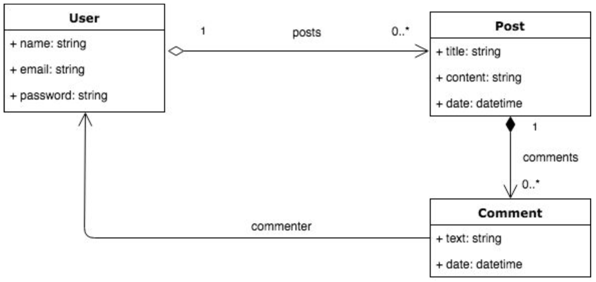

<h1 align="center">Práctico 1</h1>

## Bibliografía

https://aulas.ort.edu.uy/pluginfile.php/324178/mod_resource/content/1/S3C1.pdf

## Objetivos

El objetivo de este práctico es realizar una aplicación de ejemplo que sirva como punto de partida para utilizar a lo largo del curso.

ASPost es una aplicación en Rails donde las personas pueden postear contenido y comentar los posts de otras personas.

## Diagrama de Clases



* **User**: es el usuario del sistema, donde se conoce su nombre, email, password y la lista de posts que escribió.
* **Post**: contenido generado por cada usuario. Cada post tiene un título, contenido y la fecha de su creación. Por cada post se permite realizar comentarios.
* **Comment**: son los comentarios asociados a cada post realizados por usuarios. Cada comentario tiene un texto que es escrito por la persona que comenta y la fecha en cual fue realizado.

## Procedimiento

1. Creamos el proyecto;

    ```bash
    rails create practico-1
    cd practico-1
    ```

2. Creamos los modelos:

    ```bash
    rails generate model user name:string email:string password:string
    rails generate model post title:string content:string date:datetime
    rails generate model comment text:string date:datetime
    ```

3. Creamos las asociaciones:

    ```
    rails generate migration AddUserToPosts user:references
    rails generate migration AddUserToComments user:references
    ```

4. Agregamos los `has_many` en el archivo [`app/models/user.rb`](./src/app/models/user.rb):

    ```diff
    class User < ApplicationRecord
    +    has_many :posts
    +    has_many :comments
    end
    ```

5. Agregamos los `belongs_to` en los archivos [`app/models/comment.rb`](./src/app/models/comment.rb) y [`app/models/post.rb`](./src/app/models/post.rb):

    ```diff
    class Comment < ApplicationRecord
    +    belongs_to :user
    end
    ```

    ```diff
    class Post < ApplicationRecord
    +    belongs_to :user
    end
    ```
    
6. Agregamos los datos de ejemplo en [`db/seeds.rb`](./src/db/seeds.rb):

    ```diff
    +user = User.new name: 'Pedro', email: 'pedropicapiedra@gmail.com', password: '123456'
    +user.save!
    +
    +post = Post.new title: 'Un nuevo post!', content: 'Contenido de ejemplo', data: Date.new
    +post.user = user
    +post.save
    ```

7. Ejecutamos los siguientes comandos para generar la base de datos con los datos de prueba:

    ```bash
    rake db:migrate
    rake db:seed
    ```

8. Creamos el controlador `users` "a mano" (sin generar todo el código con la herramienta `rails`):

    Editamos el archivo [`config/application.rb`](./src/config/application.rb):

    ```diff
    module Practico1
      class Application < Rails::Application
        # Initialize configuration defaults for originally generated Rails version.
        config.load_defaults 5.2

        # Settings in config/environments/* take precedence over those specified here.
        # Application configuration can go into files in config/initializers
        # -- all .rb files in that directory are automatically loaded after loading
        # the framework and any gems in your application.
    +    config.generators.jbuilder = false
      end
    end
    ```

    Creamos el esqueleto para el controlador:

    ```bash
    rails generate controller Users new create update edit destroy index show --skip-template-engine
    ```

    Editarmos el archivo [`config/routes.rb`](./src/config/routes.rb) para agregar las rutas del recurso `users`:

    ```diff
    Rails.application.routes.draw do
    -    get 'users/new'
    -    get 'users/create'
    -    get 'users/update'
    -    get 'users/edit'
    -    get 'users/destroy'
    -    get 'users/index'
    -    get 'users/show'
    -    # For details on the DSL available within this file, see http://guides.rubyonrails.org/routing.html
    +   resources :users
    end
    ```

9. Por último, creamos la *view* para la operación `index` del controlador:

    Creamos el archivo [`app/views/users/index.html.erb`](./src/app/views/users/index.html.erb):

    ```erb
    <h1>Listado de usuarios</h1>
    <ul>
        <% @users.each do |u| %>
            <li><%= u.name %>, <%= u.email %></li>
        <% end %>
    </ul>
    ```

    Y asignamos la variable `@users` (utilizada en el archivo `.erb`) en el controlador ([`app/controllers/users_controller.rb`](./src/app/controllers/users_controller.rb)):

    ```diff
    class UsersController < ApplicationController
        def new
        end

        def create
        end

        def update
        end

        def edit
        end

        def destroy
        end

        def index
    +        @users = User.all
        end

        def show
        end
    end
    ```

10. Para ver la aplicación en acción debemos ejecutar el comando `rails server` e ir a [http://localhost:3000/users/index](http://localhost:3000/users/index) luego de que el servidor termine de iniciar:

    

## Implementación

El código fuente del práctico completo está disponible en la [carpeta src](src/).

Para ver el código fuente asociado al desafío del práctico ver el [commit 7b0afc1](https://github.com/agurodriguez/ort-ingdesoft-asp/commit/7b0afc1bf7ef34e66e6f3d8d11e49ec493153228).
